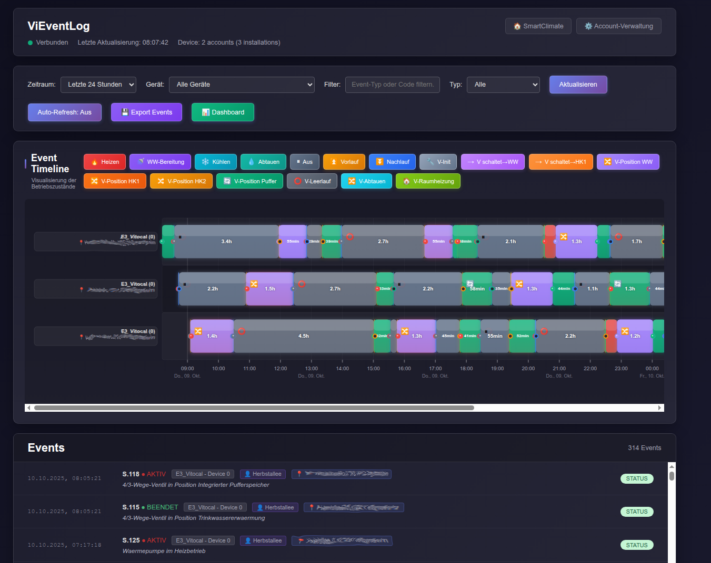

# ViEventLog

Ein benutzerfreundlicher Web-Viewer zur Visualisierung und Analyse von Betriebszuständen und Events Ihrer Viessmann Heizungsanlage über die Viessmann Developer API.

## Hintergrund

Mit der [Abschaltung von ViGuide](https://community.viessmann.de/t5/Konnektivitaet/Bekanntmachung-Abschaltung-von-ViGuide-fuer-ViCare-Benutzer/td-p/433964) durch Viessmann verlieren Anlageneigentümer die bisherige Möglichkeit, das Event-Log ihrer Heizung einzusehen. ViEventLog bietet hier eine moderne Alternative und macht diese wichtigen Informationen wieder zugänglich.

**Entwicklungshinweis:** Dieses Projekt wurde mit Unterstützung von AI entwickelt und steht als Open-Source-Lösung für die Community zur Verfügung.

**Tipp:** Wenn Sie sich für Verbraucherschutz-Tools interessieren, schauen Sie sich auch mein Projekt [RauchmelderApp.de](https://www.RauchmelderApp.de) an – eine kostenfreie Alternative zu teuren Ablesefirmen für die jährliche Rauchmelderwartung.



## Lizenz

Dieses Projekt ist unter der MIT-Lizenz lizenziert.

## Wichtige Hinweise

**Nur für private, nicht-kommerzielle Nutzung**

Diese Anwendung verwendet die Viessmann Developer API und unterliegt den Nutzungsbedingungen des Viessmann Developer Portal. Die Nutzung ist ausschließlich für private, nicht-kommerzielle Zwecke und zur Steuerung eigener Viessmann-Anlagen gestattet.

**Eigener Developer Portal Account erforderlich**

Jeder Benutzer muss einen eigenen Account im Viessmann Developer Portal erstellen und seine eigenen API-Credentials verwenden. Die Weitergabe von API-Credentials an Dritte ist nicht gestattet.

## Voraussetzungen

### Viessmann Developer Portal Account erstellen

Bevor Sie den Event Viewer nutzen können, müssen Sie einen API-Client im Viessmann Developer Portal erstellen:

1. **Anmelden beim Developer Portal**
   - Öffnen Sie https://app.developer.viessmann.com/
   - Melden Sie sich mit Ihren ViCare App Zugangsdaten an (die gleichen
     Credentials, die Sie in der ViCare App verwenden), Sofern schon eine
     HomeAssitant integration verwendet wird, kann auch die ClientID von
     HomeAssitant verwendet werden.

2. **API Client erstellen**
   - Klicken Sie auf "API-Client erstellen" oder "Create API Client"
   - Geben Sie folgende Daten ein:
     - **Name**: EventViewer (oder ein beliebiger Name für Ihre Anwendung)
     - **Google reCAPTCHA**: Deaktiviert (disabled)
     - **Redirect URIs**: `vicare://oauth-callback/everest`
   - Bestätigen Sie die Erstellung

3. **Client ID notieren**
   - Nach der Erstellung wird Ihnen eine **Client ID** angezeigt
   - Kopieren Sie diese Client ID - Sie benötigen sie für die Einrichtung des Event Viewers
   - Die Client ID ist eine lange alphanumerische Zeichenfolge (z.B. `ab741319e11245de5f91d15ff4cac2c1`)

### Systemanforderungen

- Go 1.21 oder höher (für die Kompilierung)
- Linux: libsecret / gnome-keyring für sichere Credential-Speicherung
- macOS: Keychain (bereits vorhanden)
- Windows: Credential Manager (bereits vorhanden)

## Installation

### Option 1: Binary herunterladen (empfohlen)

**Schritt 1: Download**

Besuchen Sie die [Release-Seite](https://github.com/mschneider82/vieventlog/releases) und laden Sie die passende Version für Ihr Betriebssystem herunter:

- **Windows (64-bit)**: `vieventlog_X.X.X_Windows_x86_64.zip`
- **Windows (ARM64)**: `vieventlog_X.X.X_Windows_arm64.zip`
- **macOS (Intel)**: `vieventlog_X.X.X_Darwin_x86_64.tar.gz`
- **macOS (Apple Silicon)**: `vieventlog_X.X.X_Darwin_arm64.tar.gz`
- **Linux (64-bit)**: `vieventlog_X.X.X_Linux_x86_64.tar.gz`
- **Linux (ARM64)**: `vieventlog_X.X.X_Linux_arm64.tar.gz`

**Schritt 2: Entpacken**

**Windows:**
```powershell
# Mit Windows Explorer: Rechtsklick auf die .zip Datei → "Alle extrahieren..."
# Oder mit PowerShell:
Expand-Archive vieventlog_X.X.X_Windows_x86_64.zip -DestinationPath vieventlog
cd vieventlog
```

**macOS / Linux:**
```bash
tar -xzf vieventlog_X.X.X_*.tar.gz
cd vieventlog_X.X.X_*
```

**Schritt 3: Starten**

**Windows:**
```powershell
.\vieventlog.exe
```

**macOS / Linux:**
```bash
./vieventlog
```

**macOS Hinweis:** Bei der ersten Ausführung erscheint möglicherweise eine Sicherheitswarnung. Öffnen Sie in diesem Fall die Systemeinstellungen → Sicherheit → "Dennoch öffnen".

**Schritt 4: Browser öffnen**

Nach dem Start öffnen Sie Ihren Browser und navigieren zu:
```
http://localhost:5000
```

### Option 2: Aus Quellcode kompilieren

**Mit Keyring-Support (empfohlen für Desktop):**
```bash
go mod download
go build  # Baut mit Keyring-Support
```

**Ohne Keyring (für Server/Container):**
```bash
go mod download
go build -tags nokeyring  # Baut ohne Keyring, nutzt ENV/File-Storage
```

Nach erfolgreicher Kompilierung erhalten Sie eine ausführbare Datei `vieventlog`.

**Hinweis:** Die vorkompilierten Binaries von GitHub Releases verwenden **keine Keyring-Integration** (um Cross-Platform-Builds zu ermöglichen). Sie nutzen automatisch Environment Variables oder File-Storage für Credentials. Wenn Sie Keyring-Support benötigen, kompilieren Sie bitte lokal aus dem Quellcode.

### Option 3: Docker Container (für Server/NAS)

**Schnellstart mit Docker:**

```bash
docker run -d \
  --name vieventlog \
  -p 5000:5000 \
  -e VICARE_EMAIL=ihre@email.de \
  -e VICARE_PASSWORD=ihr-passwort \
  -e VICARE_CLIENT_ID=ihre-client-id \
  -e BASIC_AUTH_USER=admin \
  -e BASIC_AUTH_PASSWORD=geheim123 \
  ghcr.io/mschneider82/vieventlog:latest
```

**Mit docker-compose (empfohlen):**

```bash
# docker-compose.yml erstellen (siehe Beispiel unten)
docker-compose up -d
```

Siehe [Docker-Deployment](#docker-deployment) für Details.

## Verwendung

### Erste Schritte

1. **ViEventLog starten**
   ```bash
   ./vieventlog
   ```

2. **Browser öffnen**

   Öffnen Sie `http://localhost:5000` in Ihrem Browser

3. **Anmelden**

   Beim ersten Start werden Sie zur Login-Seite weitergeleitet. Geben Sie folgende Daten ein:
   - **E-Mail**: Ihre ViCare App E-Mail-Adresse
   - **Passwort**: Ihr ViCare App Passwort
   - **Client ID**: Die Client ID aus dem Developer Portal (siehe Voraussetzungen)

4. **Zugangsdaten werden gespeichert**

   Nach erfolgreicher Anmeldung werden Ihre Zugangsdaten sicher im System-Keyring gespeichert. Sie müssen sich beim nächsten Start nicht erneut anmelden.

### Port ändern (optional)

Standardmäßig läuft ViEventLog auf Port 5000. Sie können einen anderen Port verwenden:

```bash
PORT=8080 ./vieventlog
```

## Docker-Deployment

### Verfügbare Container-Images

Container-Images werden automatisch für `linux/amd64` und `linux/arm64` gebaut und sind verfügbar unter:

```
ghcr.io/mschneider82/vieventlog:latest
ghcr.io/mschneider82/vieventlog:v1.2.3  # Spezifische Version
```

### Deployment-Optionen

#### 1. Einzelner Account mit Environment Variables

**Docker Run:**
```bash
docker run -d \
  --name vieventlog \
  -p 5000:5000 \
  -e VICARE_EMAIL=ihre@email.de \
  -e VICARE_PASSWORD=ihr-passwort \
  -e VICARE_CLIENT_ID=ihre-client-id \
  -e VICARE_ACCOUNT_NAME="Mein Haus" \
  -e BASIC_AUTH_USER=admin \
  -e BASIC_AUTH_PASSWORD=geheim123 \
  --restart unless-stopped \
  ghcr.io/mschneider82/vieventlog:latest
```

**docker-compose.yml:**
```yaml
version: '3.8'

services:
  vieventlog:
    image: ghcr.io/mschneider82/vieventlog:latest
    container_name: vieventlog
    ports:
      - "5000:5000"
    environment:
      - VICARE_EMAIL=ihre@email.de
      - VICARE_PASSWORD=ihr-passwort
      - VICARE_CLIENT_ID=ihre-client-id
      - VICARE_ACCOUNT_NAME=Mein Haus
      - BASIC_AUTH_USER=admin
      - BASIC_AUTH_PASSWORD=geheim123
    restart: unless-stopped
```

#### 2. Multi-Account mit Config-File

**docker-compose.yml:**
```yaml
version: '3.8'

services:
  vieventlog:
    image: ghcr.io/mschneider82/vieventlog:latest
    container_name: vieventlog
    ports:
      - "5000:5000"
    volumes:
      - ./config:/config
    environment:
      - VICARE_CONFIG_DIR=/config
      - BASIC_AUTH_USER=admin
      - BASIC_AUTH_PASSWORD=geheim123
    restart: unless-stopped
```

**Config-File erstellen (`./config/accounts.json`):**
```json
{
  "accounts": {
    "user1@example.com": {
      "id": "user1@example.com",
      "name": "Haupthaus",
      "email": "user1@example.com",
      "password": "passwort1",
      "clientId": "client-id-1",
      "clientSecret": "8ad97aceb92c5892e102b093c7c083fa",
      "active": true
    },
    "user2@example.com": {
      "id": "user2@example.com",
      "name": "Ferienhaus",
      "email": "user2@example.com",
      "password": "passwort2",
      "clientId": "client-id-2",
      "clientSecret": "8ad97aceb92c5892e102b093c7c083fa",
      "active": true
    }
  }
}
```

**Wichtig:** Schützen Sie die `accounts.json` Datei:
```bash
chmod 600 ./config/accounts.json
```

#### 3. Hinter Reverse Proxy (z.B. Nginx, Traefik)

Wenn Sie bereits einen Reverse Proxy mit Authentifizierung verwenden:

```yaml
version: '3.8'

services:
  vieventlog:
    image: ghcr.io/mschneider82/vieventlog:latest
    container_name: vieventlog
    ports:
      - "127.0.0.1:5000:5000"  # Nur localhost
    environment:
      - VICARE_EMAIL=ihre@email.de
      - VICARE_PASSWORD=ihr-passwort
      - VICARE_CLIENT_ID=ihre-client-id
      # Kein BASIC_AUTH nötig - Reverse Proxy übernimmt
    restart: unless-stopped
```

### Environment Variables (Container)

| Variable | Beschreibung | Beispiel | Standard |
|----------|--------------|----------|----------|
| `BIND_ADDRESS` | Bind-Adresse und Port | `0.0.0.0:5000` | `0.0.0.0:5000` |
| `VICARE_EMAIL` | ViCare Account E-Mail | `user@example.com` | - |
| `VICARE_PASSWORD` | ViCare Account Passwort | `geheim123` | - |
| `VICARE_CLIENT_ID` | Developer Portal Client ID | `ab741319...` | - |
| `VICARE_ACCOUNT_NAME` | Anzeigename für Account | `Mein Haus` | E-Mail |
| `VICARE_CONFIG_DIR` | Config-Verzeichnis für accounts.json | `/config` | `/config` |
| `VICARE_ACCOUNTS` | Multi-Account als JSON | `{"accounts":{...}}` | - |
| `BASIC_AUTH_USER` | Basic Auth Benutzername | `admin` | - |
| `BASIC_AUTH_PASSWORD` | Basic Auth Passwort | `geheim123` | - |

**Hinweis:** Im Container wird **kein** System-Keyring verwendet. Credentials müssen über ENV-Vars oder Config-File bereitgestellt werden.

### Sicherheitshinweise für Container

1. **Basic Auth aktivieren:** Wenn der Container aus dem Internet erreichbar ist:
   ```yaml
   environment:
     - BASIC_AUTH_USER=admin
     - BASIC_AUTH_PASSWORD=ein-sicheres-passwort
   ```

2. **Secrets Management:** Verwenden Sie Docker Secrets oder externe Secret-Manager:
   ```yaml
   services:
     vieventlog:
       secrets:
         - vicare_password
       environment:
         - VICARE_PASSWORD_FILE=/run/secrets/vicare_password
   ```

3. **Config-File Permissions:**
   ```bash
   chmod 600 config/accounts.json
   chown 1000:1000 config/accounts.json
   ```

4. **Reverse Proxy verwenden:** Für zusätzliche Sicherheit (TLS, Rate-Limiting, etc.)

### Logs anzeigen

```bash
# Docker
docker logs vieventlog

# Docker Compose
docker-compose logs -f
```

### Container aktualisieren

```bash
# Neues Image holen
docker pull ghcr.io/mschneider82/vieventlog:latest

# Container neu starten
docker-compose down && docker-compose up -d
```

## Features

### Multi-Account-Unterstützung

Der Event Viewer unterstützt mehrere Viessmann-Accounts gleichzeitig. Dies ist nützlich, wenn Sie mehrere Heizungsanlagen mit unterschiedlichen ViCare-Accounts verwalten.

**Account-Verwaltung aufrufen:**
- Klicken Sie auf das Zahnrad-Symbol oben rechts in der Hauptansicht
- Oder öffnen Sie direkt: `http://localhost:5000/accounts`

**Funktionen:**
- Mehrere Accounts hinzufügen
- Accounts aktivieren/deaktivieren
- Accounts bearbeiten oder löschen
- Events von allen aktiven Accounts werden kombiniert angezeigt
- Jedes Event zeigt den zugehörigen Account und Standort

### Dashboard-Ansicht

Das Dashboard bietet eine übersichtliche Echtzeitansicht aller wichtigen Parameter Ihrer Heizungsanlage:

- Live-Anzeige von Temperaturen: Außentemperatur, Vorlauf, Rücklauf, Puffer, Primär- und Sekundärkreis
- Kompressor-Status bei Wärmepumpen: Drehzahl, Leistung, Ein-/Auslasstemperatur
- Brenner-Status bei Gasheizungen: Modulation, Betriebszustand
- Warmwasser-Informationen: Ist- und Soll-Temperatur, Betriebsmodus
- Heizkreis-Status: Betriebsmodus, Betriebsprogramm
- Heizkurve: Steigung und Verschiebung
- Zusätzliche Sensoren: Volumenstrom, Druck, interne Pumpe, Lüfter
- Effizienz-Kennzahlen: SCOP/SPF für Heizung und Warmwasser
- Unterstützung mehrerer Geräte pro Installation (z.B. Wärmepumpe + Gasheizung)
- Automatische Anpassung der Anzeige je nach Gerätetyp (Vitocal, Vitodens, etc.)

Das Dashboard ist über den entsprechenden Button in der Hauptansicht erreichbar und aktualisiert sich automatisch.

### Timeline-Visualisierung

Die Timeline zeigt grafisch die Betriebszustände Ihrer Heizungsanlage über die Zeit:

- Farbcodierte Zustände: Heizen, Warmwasser, Vorlauf, Nachlauf, Aus
- Anzeige von Dauer und Start-/Ende-Zeiten
- Berücksichtigung von Ventilstellungen (Heizen vs. Warmwasser-Bereitung)

### Event-Liste mit Filterung

- Chronologische Sortierung (neueste zuerst)
- Filterung nach Installation/Gerät
- Filterung nach Event-Typ (Status-Codes/Fehler-Codes/Aktive Events)
- Freitext-Suche über alle Event-Felder
- Zeitraum-Filter: 24 Stunden bis alle Events

### Deutsche Error-Code-Übersetzung

Automatische Übersetzung von Viessmann Status- und Fehler-Codes:

- **S-Codes (Status)**: Betriebszustände wie "Heizen", "Warmwasser-Bereitung", "Abtauung"
- **F-Codes (Fehler)**: Störungen wie Sensorfehler, Druckprobleme
- Automatische Kategorisierung und Schweregrad-Erkennung

### Sichere Credential-Speicherung

Ihre Zugangsdaten werden sicher im System-Keyring gespeichert, nicht auf der Festplatte:

- **Linux**: libsecret / gnome-keyring
- **macOS**: Keychain
- **Windows**: Credential Manager

### Event-Caching und Performance

- Events werden 5 Minuten gecacht für schnellere Ladezeiten
- Thread-safe Implementierung mit Mutex-Synchronisation
- OAuth2 Token werden pro Account gecacht
- Automatisches Token-Refresh

## API Endpoints

### Hauptseiten

- `GET /` - Web UI (Event-Viewer)
- `GET /login` - Login-Seite
- `GET /accounts` - Account-Verwaltung
- `GET /dashboard` - Dashboard-Ansicht mit Live-Daten

### API

#### Events und Status
- `GET /api/events?days=7` - Events abrufen (Parameter: 1, 7, 14, 30 oder 365 für "Alle")
- `GET /api/status` - Verbindungsstatus und Account-Info
- `GET /api/devices` - Geräteliste gruppiert nach Installation
- `GET /api/features?installationId=XXX&gatewaySerial=YYY&deviceId=0&refresh=true` - Feature-Daten für Dashboard

#### Account-Verwaltung
- `GET /api/accounts` - Liste aller gespeicherten Accounts
- `POST /api/accounts/add` - Account hinzufügen
  ```json
  {
    "name": "Haupthaus",
    "email": "ihre@email.de",
    "password": "ihr-passwort",
    "clientId": "ihre-client-id",
    "active": true
  }
  ```
- `POST /api/accounts/toggle` - Account aktivieren/deaktivieren
  ```json
  {
    "id": "account-id",
    "active": true
  }
  ```
- `POST /api/accounts/delete` - Account löschen
  ```json
  {
    "id": "account-id"
  }
  ```

#### Login
- `POST /api/login` - Anmeldung mit Viessmann-Credentials
  ```json
  {
    "email": "ihre@email.de",
    "password": "ihr-passwort",
    "clientId": "ihre-client-id"
  }
  ```
- `GET /api/credentials/check` - Prüft, ob gespeicherte Credentials vorhanden sind

## Technische Details

### Architektur

- **Backend**: Go mit integriertem HTTP-Server
- **Frontend**: Vanilla JavaScript, keine externen Frameworks
- **Templates**: Embedded HTML-Templates (keine externen Dateien erforderlich)
- **Storage**: System-Keyring für Credentials, Memory-Cache für Events und Tokens

### Dependencies

- Go Standard Library
- System-Keyring Libraries (plattformabhängig)

### Build-Eigenschaften

- Standalone Binary ohne externe Abhängigkeiten zur Laufzeit
- Alle Templates sind im Binary eingebettet
- Geringer Memory-Footprint
- Schnelle Startzeit

## Troubleshooting

### Login schlägt fehl

- Überprüfen Sie Ihre ViCare App Zugangsdaten
- Stellen Sie sicher, dass die Client ID korrekt aus dem Developer Portal kopiert wurde
- Prüfen Sie, ob die Redirect URI im Developer Portal korrekt konfiguriert ist: `vicare://oauth-callback/everest`

### Events werden nicht angezeigt

- Überprüfen Sie, ob mindestens ein Account aktiviert ist (Account-Verwaltung)
- Stellen Sie sicher, dass Ihre Viessmann-Anlage Events generiert hat
- Prüfen Sie den Zeitraum-Filter (Standard: "Alle")

### Keyring-Fehler unter Linux

Falls der Keyring nicht verfügbar ist, installieren Sie:
```bash
# Debian/Ubuntu
sudo apt-get install gnome-keyring libsecret-1-0

# Fedora/RHEL
sudo dnf install gnome-keyring libsecret
```

### Container startet nicht / keine Credentials

**Problem:** Container läuft, aber zeigt "no credentials configured"

**Lösung:**
- Prüfen Sie die Environment Variables mit `docker inspect vieventlog`
- Stellen Sie sicher, dass mindestens `VICARE_EMAIL`, `VICARE_PASSWORD` und `VICARE_CLIENT_ID` gesetzt sind
- Logs prüfen: `docker logs vieventlog`

**Problem:** "Authentication failed" beim Start

**Lösung:**
- Verifizieren Sie Ihre Credentials in der ViCare App
- Prüfen Sie die Client ID im Developer Portal
- Stellen Sie sicher, dass die Redirect URI korrekt ist: `vicare://oauth-callback/everest`

### Container-Image nicht gefunden

Stellen Sie sicher, dass Sie den korrekten Image-Namen verwenden:
```bash
# Richtig
docker pull ghcr.io/mschneider82/vieventlog:latest

# Falsch (ohne ghcr.io)
docker pull mschneider82/vieventlog:latest
```

## Entwicklung

### Tests ausführen

```bash
go test -v ./...
```

### Code formatieren

```bash
go fmt ./...
go vet ./...
```

### Dependencies aktualisieren

```bash
go mod tidy
```

## Beiträge

Contributions sind willkommen! Bitte beachten Sie:
- Code sollte den Go-Konventionen folgen (`go fmt`, `go vet`)
- Neue Features sollten dokumentiert werden
- Bug-Reports mit reproduzierbaren Schritten sind hilfreich

## Support

**Hinweis:** Diese Software wurde größtenteils mit AI-Unterstützung entwickelt.

Bei Fragen, Problemen oder Anregungen öffnen Sie bitte ein Issue auf GitHub. Wir freuen uns über Bug-Reports und Feature-Vorschläge!

## Haftungsausschluss

Diese Software wird "wie besehen" ohne jegliche Garantie bereitgestellt. Die Nutzung erfolgt auf eigenes Risiko. Der Autor übernimmt keine Haftung für Schäden, die durch die Nutzung dieser Software entstehen.

Diese Software ist nicht offiziell von Viessmann unterstützt. Sie verwendet die öffentliche Viessmann Developer API gemäß den Nutzungsbedingungen.